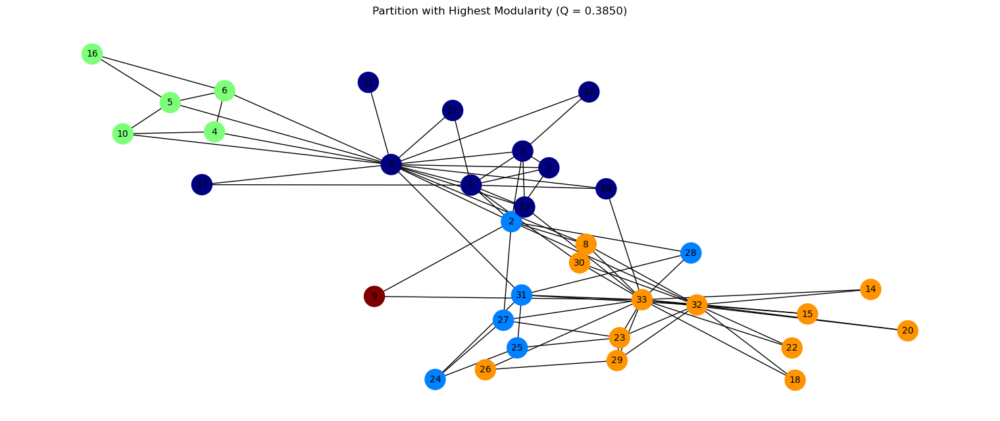
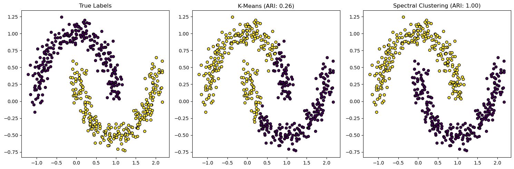

# Graph Analysis

In this repo we look at data as a graph, nodes connected with links:
- Review Graph Clustering Formulation and Notation
- Implement several graph clustering methods and evaluate  

    

- Apply Spectral Clustering and compare its performance with K-Means

    

